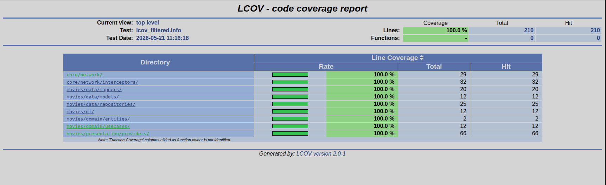

# Remote Content Explorer

> Descubre películas en cartelera y tendencias, busca títulos en tiempo real y explora el reparto completo — todo consumiendo la API de [The Movie Database (TMDB)](https://www.themoviedb.org/).

---

## Demo

[](https://youtube.com/shorts/JDEG_QDUhs8)

---

## Instalación directa

Descarga e instala el APK

[](https://drive.google.com/file/d/1K4P65ggmcGNDDUAsKpshm3wdaSDKZJwm/view?usp=sharing)

---

## Pantallas

| Home | Buscador | Detalle |
|------|----------|---------|
| Carrusel de estrenos + tendencias con scroll automático | Búsqueda en tiempo real con debounce | Backdrop, poster con Hero animation y reparto |

---

## Arquitectura

El proyecto sigue **Clean Architecture** con separación estricta de capas y principios SOLID:

```
lib/
├── core/
│   ├── constants/          # Rutas y endpoints
│   ├── network/            # Dio, executeApiCall, Failure, interceptores
│   └── theme/              # Tema claro y oscuro
└── movies/
    ├── data/
    │   ├── datasources/    # Retrofit client (TMDB)
    │   ├── mappers/        # Model → Entity
    │   ├── models/         # DTOs con json_serializable
    │   └── repositories/   # Implementación del repositorio
    ├── di/                 # Providers de Riverpod (DI)
    ├── domain/
    │   ├── entities/       # Movie, Actor — Dart puro
    │   ├── repositories/   # Contrato abstracto
    │   └── usecases/       # Casos de uso invocables
    └── presentation/
        ├── pages/          # HomePage, MovieDetailPage
        ├── providers/      # Notifiers con Riverpod
        └── widgets/        # MovieCarousel, MovieHorizontalList, ActorCard
```

---

## Stack técnico

| Capa | Tecnología |
|---|---|
| State management | [flutter_riverpod](https://pub.dev/packages/flutter_riverpod) + riverpod_generator |
| HTTP client | [Dio](https://pub.dev/packages/dio) + [Retrofit](https://pub.dev/packages/retrofit) |
| Serialización | [json_serializable](https://pub.dev/packages/json_serializable) |
| Manejo de errores | [dartz](https://pub.dev/packages/dartz) — `Either<Failure, T>` |
| Tests | [mocktail](https://pub.dev/packages/mocktail) |

---

## Tests

```
test/
├── core/network/
│   ├── interceptors/
│   │   └── logging_interceptor_test.dart
│   ├── dio_provider_test.dart
│   ├── execute_api_call_test.dart
│   └── failure_test.dart
└── movies/
    ├── data/
    │   ├── mappers/
    │   │   ├── actor_mapper_test.dart
    │   │   └── movie_mapper_test.dart
    │   ├── models/
    │   │   └── models_test.dart
    │   └── repositories/
    │       └── movie_repository_impl_test.dart
    ├── di/
    │   └── movies_di_test.dart
    ├── domain/usecases/
    │   └── movie_usecases_test.dart
    └── presentation/providers/
        ├── movie_list_state_test.dart
        ├── movie_search_notifier_test.dart
        ├── now_playing_notifier_test.dart
        └── popular_movies_notifier_test.dart
```

Ejecutar todos los tests:

```bash
flutter test
```

Generar reporte de cobertura:

```bash
./coverage.sh
```



---

## Cómo ejecutar el proyecto

### Prerrequisitos

- Flutter SDK `3.44.0` (stable)
- Dart SDK `^3.11.5`

### Instalación

```bash
# Clonar el repositorio
git clone https://github.com/vmgarciahurtado/remote_content_explorer.git

# Entrar al proyecto
cd remote_content_explorer

# Instalar dependencias
flutter pub get

# Ejecutar generación de código
dart run build_runner build --delete-conflicting-outputs

# Correr la app
flutter run
```
